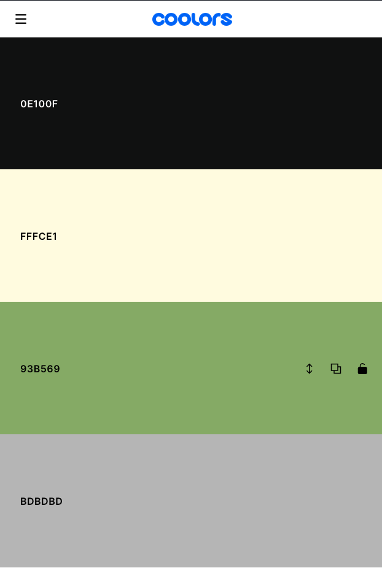
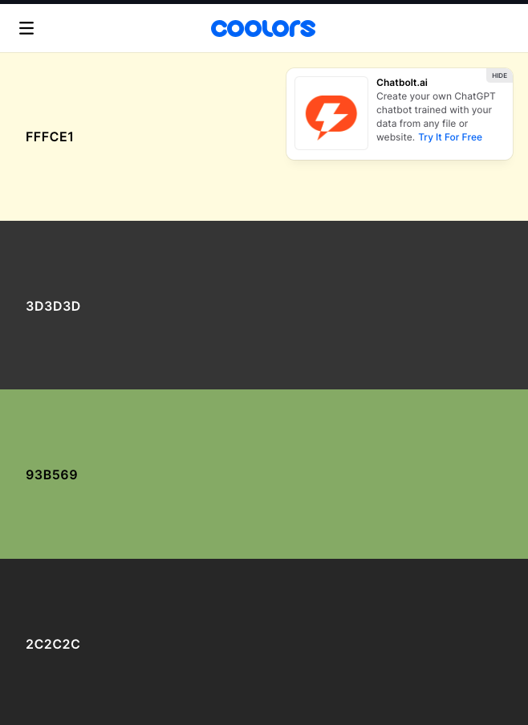

# [TASKBLOOMER](https://raymondbrien.github.io/taskbloomer)

# 🚀 TaskBloomer: Where Priorities Blossom. 🚀 

Are you drowning in a sea of tasks, struggling to stay afloat trying to decide which tasks to prioritise? Say goodbye to chaos and hello to clarity with TaskBloomer, the task management app designed reward you for making three concise to-dos which shape your day.

## 🎯 Step 1: Streamline three main goals

Create three tasks, one big, one medium, one small. Each goal must be no more than 25 characters, so aim for something concise and intentional.

Prioritize your tasks with a user-friendly interface that ensures you spend less time managing and more time accomplishing. Say goodbye to scattered to-do lists and hello to efficient, well-organized workflow in three simple steps.

## 🌟 Step 2: Rank your tasks in order of priority

Each task is ranked from biggets to smallest, represeted by the amount of points each task earns you.

Task A, your biggest task, earns you three points when you tick it off. 
Task B earns you 2 points.
Task C, 1 point.

TaskBloomer understands the toll of decision fatigue on productivity. It's interesting to notice how decision making can become easier when you have points associated with them. That's what we are exploring here. 
Guide your decision-making process effortlessly with TaskBloomer to leave you with more mental bandwidth for the tasks that truly matter.

## 🏆 Step 3: Reward yourself with each completed task

By focussing on what matters most, each time you check off a goal, your points go towards earning you an NFT. With real-time progress tracking and a gallery at the end to look through all the lovely pieces you've collected from all your hard work, you'll always be in the driver's seat, steering towards success without feeling overwhelmed.

### Extra goodies:
1 - Track your progress with helpful stats and beautiful sets of NFTs from artists all over the world.
2 - Set the difficulty rating: choose if the amounts of points you need for each NFT are easier (less points needed per NFT), medium (a few more needed for each) or hard (for those who like a challenge).
3 - New lightmode feature for your tasks area.

✨ Simplify Your Life: Unclutter your mind and workspace for enhanced productivity.
✨ Stay Focused: Say goodbye to decision fatigue and hello to laser-sharp focus.
✨ Achieve More: Leverage your hard work by earning each time you complete a task, tracking progress to completing your gallery along the way.

🌺 TaskBloomer: Where Priorities Blossom 🌺

Dear Ambitious Achievers,

Whether you a professional seeking a better system to order their daily tasks, a freelancer juggling multiple projects feeling unrewarded by continuious to-dos, or perhaps an art enthusiast looking for their next online art collection, TaskBloomer is crafted with YOU in mind.

TaskBloomer is unique, not only because you earn points for every task you check off (which in itself is satisfying!), but your points automatically earn you assets each time you check off a task. You'll quickly find yourself noshing through those tasks for breakfast! 

The added benefit of including NFTs as part of your earning portfolio each time you hit a point threshold not only gives you the chance to look back at your NFTs and celebrate the work you have done to earn them, but also introduces you to new artists from across the globe!

<!-- UPDATE ONCE PHONE MEDIA QUERY ADDED -->
https://ui.dev/amiresponsive?url=https://raymondbrien.github.io/taskbloomer

<!-- TODO -->

## UX

TaskBloomer's design has been inspired by productivity sites such as Notion, featuring a deluxe yet visually simple aethetic to avoid overstimulation, with the main interactive areas clear and consise.

TaskBloomer is made up intentionally of two main pages (landing page with instructions, and the main task area) to make navigation feel clean and simple to use. All bonus features such as the stats area and gallery are included with user needs in mind. 
Principally the main ideas are prioritised:
- How to play 
- Setting consise task descriptions 
- Earning NFTs 
- Checking your stats

*Your feedback is crucial, so please share your thoughts to help us refine and enhance our user-centric approach. Let's make every click count! * 🚀 

### Colour Scheme

The default color scheme is a dark theme, consisting of the follwing colors:  

- `#0e100f` used for background.
- `#fffce1` used for primary text.
- `#93B569` used for primary highlights.
- `#BDBDBD` used for secondary highlights.

If light mode is enabled on the task area by the user, the following custom variables are used: 

- `#fffce1` used for background.
- `#3D3D3D` used for primary text.
- `#93B569` used for primary highlights.
- `#2c2c2c` used for secondary highlights.

I used coolors.co to generate my colour palettes.

[coolors.co](https://coolors.co/0e100f-fffce1-93b569-bdbdbd)
[coolors.co](https://coolors.co/fffce1-3d3d3d-93b569-2c2c2c)

I also ensured that for the text and background colors for both dark and light mode were verified accessible through coolors' [coolors.co] (https://coolors.co/contrast-checker/112a46-acc8e5) color contrast checker for maximum accessibility.

### Typography

- [EB Garamond](https://fonts.google.com/specimen/EB+Garamond) was used for all text elements, chosen for its readability and established use across platforms.

- [Font Awesome](https://fontawesome.com) icons were used throughout the site, such as the icons for the hero cards on the landing page.

<!-- Add favicon source? -->

## User Stories

### New Site Users

- As a new site user, I would like to set goals, so that I can feel more in control of my to-do list for the day.
- As a new site user, I would like to reduce overwhelm, so that I can feel more productive during my day.
- As a new site user, I would like to see clean visuals, so that I don't feel overwhelmed with information.
- As a new site user, I would like to learn how to use the site, so that I can make the most of the application.
- As a new site user, I would like to track my to-dos, so that I can feel productive.

### Returning Site Users

- As a returning site user, I would like to track my progress, so that I can to remain motivated and engaged with my tasks.
- As a returning site user, I would like to make sure that if any tasks have been accidentally marked uncomplete, I can see that has happened and fix it, to make sure I earn all my points for the day.
- As a returning site user, I would like to have my tasks clear automatically, so that I can avoid unneccessary extra menial tasks.
- As a returning site user, I would like to be able to switch the colorscheme, so that I can improve the accessibility of my tasks area.

## Wireframes

<!-- In this section, display your wireframe screenshots using a Markdown `table`.
Instructions on how to do Markdown `tables` start on line #213 on this site: https://pandao.github.io/editor.md/en.html

Alternatively, dropdowns are a way to condense several wireframes into a collapsible menu to save space.
Dropdowns in Markdown are considered some of the only acceptable HTML components that are allowed for assessment purposes.

**IMPORTANT**! **IMPORTANT**! **IMPORTANT**!
The example below uses the `details` and `summary` code elements.
However, for these scripts to work, I've had to add spaces within the `< >` elements.

You MUST remove these spaces for it to work properly on your own README/TESTING files.
Remove the spaces within the `< >` brackets for the `details` and `summary` code elements,
for the Mobile, Tablet, and Desktop wireframes.

🛑🛑🛑🛑🛑 END OF NOTES (to be deleted) 🛑🛑🛑🛑🛑

To follow best practice, wireframes were developed for mobile, tablet, and desktop sizes.
I've used [Balsamiq](https://balsamiq.com/wireframes) to design my site wireframes. -->

### Mobile Wireframes

 Click here to see the Mobile Wireframes 

Home
  - 

About
  - 

Contact
  - 

Gallery
  - 

etc.
  - repeat for any remaining mobile wireframes

### Tablet Wireframes

 Click here to see the Tablet Wireframes 

Home
  - 

About
  - 

Contact
  - 

Gallery
  - 

etc.
  - repeat for any remaining tablet wireframes

### Desktop Wireframes

< details >
< summary > Click here to see the Desktop Wireframes < / summary >

Home
  - 

About
  - 

Contact
  - 

Gallery
  - 

etc.
  - repeat for any remaining desktop wireframes

< / details >

## Features

🛑🛑🛑🛑🛑 START OF NOTES (to be deleted) 🛑🛑🛑🛑🛑

In this section, you should go over the different parts of your project,
and describe each in a sentence or so.

You will need to explain what value each of the features provides for the user,
focusing on who this website is for, what it is that they want to achieve,
and how your project is the best way to help them achieve these things.

For some/all of your features, you may choose to reference the specific project files that implement them.

IMPORTANT: Remember to always include a screenshot of each individual feature!

🛑🛑🛑🛑🛑 END OF NOTES (to be deleted) 🛑🛑🛑🛑🛑

### Existing Features

- **Title for feature #1**

    - Details about this particular feature, including the value to the site, and benefit for the user. Be as detailed as possible!

- **Title for feature #2**

    - Details about this particular feature, including the value to the site, and benefit for the user. Be as detailed as possible!

- **Title for feature #3**

    - Details about this particular feature, including the value to the site, and benefit for the user. Be as detailed as possible!

🛑🛑🛑🛑🛑 START OF NOTES (to be deleted) 🛑🛑🛑🛑🛑

Repeat as necessary for as many features as your site contains.

Hint: the more, the merrier!

🛑🛑🛑🛑🛑 END OF NOTES (to be deleted) 🛑🛑🛑🛑🛑

### Future Features

🛑🛑🛑🛑🛑 START OF NOTES (to be deleted) 🛑🛑🛑🛑🛑

Do you have additional ideas that you'd like to include on your project in the future?
Fantastic! List them here!
It's always great to have plans for future improvements!
Consider adding any helpful links or notes to help remind you in the future, if you revisit the project in a couple years.

🛑🛑🛑🛑🛑 END OF NOTES (to be deleted) 🛑🛑🛑🛑🛑

- Title for future feature #1
    - Any additional notes about this feature.
- Title for future feature #2
    - Any additional notes about this feature.
- Title for future feature #3
    - Any additional notes about this feature.

## Tools & Technologies Used

🛑🛑🛑🛑🛑 START OF NOTES (to be deleted) 🛑🛑🛑🛑🛑

In this section, you should explain the various tools and technologies used to develop the project.
Make sure to put a link (where applicable) to the source, and explain what each was used for.
Some examples have been provided, but this is just a sample only, your project might've used others.
Feel free to delete any unused items below as necessary.

🛑🛑🛑🛑🛑 END OF NOTES (to be deleted) 🛑🛑🛑🛑🛑

- [HTML](https://en.wikipedia.org/wiki/HTML) used for the main site content.
- [CSS](https://en.wikipedia.org/wiki/CSS) used for the main site design and layout.
- [CSS :root variables](https://www.w3schools.com/css/css3_variables.asp) used for reusable styles throughout the site.
- [CSS Flexbox](https://www.w3schools.com/css/css3_flexbox.asp) used for an enhanced responsive layout.
- [CSS Grid](https://www.w3schools.com/css/css_grid.asp) used for an enhanced responsive layout.
- [JavaScript](https://www.javascript.com) used for user interaction on the site.
- [Python](https://www.python.org) used as the back-end programming language.
- [Git](https://git-scm.com) used for version control. (`git add`, `git commit`, `git push`)
- [GitHub](https://github.com) used for secure online code storage.
- [GitHub Pages](https://pages.github.com) used for hosting the deployed front-end site.
- [Gitpod](https://gitpod.io) used as a cloud-based IDE for development.
- [Codeanywhere](https://codeanywhere.com) used as a cloud-based IDE for development.
- [Bootstrap](https://getbootstrap.com) used as the front-end CSS framework for modern responsiveness and pre-built components.
- [Materialize](https://materializecss.com) used as the front-end CSS framework for modern responsiveness and pre-built components.
- [Flask](https://flask.palletsprojects.com) used as the Python framework for the site.
- [Django](https://www.djangoproject.com) used as the Python framework for the site.
- [MongoDB](https://www.mongodb.com) used as the non-relational database management with Flask.
- [SQLAlchemy](https://www.sqlalchemy.org) used as the relational database management with Flask.
- [PostgreSQL](https://www.postgresql.org) used as the relational database management.
- [ElephantSQL](https://www.elephantsql.com) used as the Postgres database.
- [Heroku](https://www.heroku.com) used for hosting the deployed back-end site.
- [Cloudinary](https://cloudinary.com) used for online static file storage.
- [Stripe](https://stripe.com) used for online secure payments of ecommerce products/services.
- [AWS S3](https://aws.amazon.com/s3) used for online static file storage.

## Testing

For all testing, please refer to the [TESTING.md](TESTING.md) file.

## Deployment

The site was deployed to GitHub Pages. The steps to deploy are as follows:

- In the [GitHub repository](https://github.com/RaymondBrien/taskbloomer), navigate to the Settings tab 
- From the source section drop-down menu, select the **Main** Branch, then click "Save".
- The page will be automatically refreshed with a detailed ribbon display to indicate the successful deployment.

The live link can be found [here](https://raymondbrien.github.io/taskbloomer)

### Local Deployment

This project can be cloned or forked in order to make a local copy on your own system.

#### Cloning

You can clone the repository by following these steps:

1. Go to the [GitHub repository](https://github.com/RaymondBrien/taskbloomer) 
2. Locate the Code button above the list of files and click it 
3. Select if you prefer to clone using HTTPS, SSH, or GitHub CLI and click the copy button to copy the URL to your clipboard
4. Open Git Bash or Terminal
5. Change the current working directory to the one where you want the cloned directory
6. In your IDE Terminal, type the following command to clone my repository:
	- `git clone https://github.com/RaymondBrien/taskbloomer.git`
7. Press Enter to create your local clone.

Alternatively, if using Gitpod, you can click below to create your own workspace using this repository.

Please note that in order to directly open the project in Gitpod, you need to have the browser extension installed.
A tutorial on how to do that can be found [here](https://www.gitpod.io/docs/configure/user-settings/browser-extension).

#### Forking

By forking the GitHub Repository, we make a copy of the original repository on our GitHub account to view and/or make changes without affecting the original owner's repository.
You can fork this repository by using the following steps:

1. Log in to GitHub and locate the [GitHub Repository](https://github.com/RaymondBrien/taskbloomer)
2. At the top of the Repository (not top of page) just above the "Settings" Button on the menu, locate the "Fork" Button.
3. Once clicked, you should now have a copy of the original repository in your own GitHub account!

### Local VS Deployment

🛑🛑🛑🛑🛑 START OF NOTES (to be deleted) 🛑🛑🛑🛑🛑

Use this space to discuss any differences between the local version you've developed, and the live deployment site on GitHub Pages.

🛑🛑🛑🛑🛑 END OF NOTES (to be deleted) 🛑🛑🛑🛑🛑

## Credits

🛑🛑🛑🛑🛑 START OF NOTES (to be deleted) 🛑🛑🛑🛑🛑

In this section you need to reference where you got your content, media, and extra help from.
It is common practice to use code from other repositories and tutorials,
however, it is important to be very specific about these sources to avoid plagiarism.

🛑🛑🛑🛑🛑 END OF NOTES (to be deleted) 🛑🛑🛑🛑🛑

### Content

🛑🛑🛑🛑🛑 START OF NOTES (to be deleted) 🛑🛑🛑🛑🛑

Use this space to provide attribution links to any borrowed code snippets, elements, or resources.
A few examples have been provided below to give you some ideas.

Ideally, you should provide an actual link to every resource used, not just a generic link to the main site!

🛑🛑🛑🛑🛑 END OF NOTES (to be deleted) 🛑🛑🛑🛑🛑

| Source | Location | Notes |
| --- | --- | --- |
| [Markdown Builder](https://tim.2bn.dev/markdown-builder) | README and TESTING | tool to help generate the Markdown files |
| [Chris Beams](https://chris.beams.io/posts/git-commit) | version control | "How to Write a Git Commit Message" |
| [W3Schools](https://www.w3schools.com/howto/howto_js_topnav_responsive.asp) | entire site | responsive HTML/CSS/JS navbar |
| [W3Schools](https://www.w3schools.com/howto/howto_css_modals.asp) | contact page | interactive pop-up (modal) |
| [W3Schools](https://www.w3schools.com/css/css3_variables.asp) | entire site | how to use CSS :root variables |
| [Flexbox Froggy](https://flexboxfroggy.com/) | entire site | modern responsive layouts |
| [Grid Garden](https://cssgridgarden.com) | entire site | modern responsive layouts |
| [StackOverflow](https://stackoverflow.com/a/2450976) | quiz page | Fisher-Yates/Knuth shuffle in JS |
| [YouTube](https://www.youtube.com/watch?v=YL1F4dCUlLc) | leaderboard | using `localStorage()` in JS for high scores |
| [YouTube](https://www.youtube.com/watch?v=u51Zjlnui4Y) | PP3 terminal | tutorial for adding color to the Python terminal |
| [strftime](https://strftime.org) | CRUD functionality | helpful tool to format date/time from string |
| [WhiteNoise](http://whitenoise.evans.io) | entire site | hosting static files on Heroku temporarily |

### Media

🛑🛑🛑🛑🛑 START OF NOTES (to be deleted) 🛑🛑🛑🛑🛑

Use this space to provide attribution links to any images, videos, or audio files borrowed from online.
A few examples have been provided below to give you some ideas.

If you're the owner (or a close acquaintance) of all media files, then make sure to specify this.
Let the assessors know that you have explicit rights to use the media files within your project.

Ideally, you should provide an actual link to every media file used, not just a generic link to the main site!
The list below is by no means exhaustive. Within the Code Institute Slack community, you can find more "free media" links
by sending yourself the following command: `!freemedia`.

🛑🛑🛑🛑🛑 END OF NOTES (to be deleted) 🛑🛑🛑🛑🛑

| Source | Location | Type | Notes |
| --- | --- | --- | --- |
| [Pexels](https://www.pexels.com) | entire site | image | favicon on all pages |
| [Lorem Picsum](https://picsum.photos) | home page | image | hero image background |
| [Unsplash](https://unsplash.com) | product page | image | sample of fake products |
| [Pixabay](https://pixabay.com) | gallery page | image | group of photos for gallery |
| [Wallhere](https://wallhere.com) | footer | image | background wallpaper image in the footer |
| [This Person Does Not Exist](https://thispersondoesnotexist.com) | testimonials | image | headshots of fake testimonial images |
| [Audio Micro](https://www.audiomicro.com/free-sound-effects) | game page | audio | free audio files to generate the game sounds |
| [Videvo](https://www.videvo.net/) | home page | video | background video on the hero section |
| [TinyPNG](https://tinypng.com) | entire site | image | tool for image compression |

### Acknowledgements

🛑🛑🛑🛑🛑 START OF NOTES (to be deleted) 🛑🛑🛑🛑🛑

Use this space to provide attribution to any supports that helped, encouraged, or supported you throughout the development stages of this project.
A few examples have been provided below to give you some ideas.

🛑🛑🛑🛑🛑 END OF NOTES (to be deleted) 🛑🛑🛑🛑🛑

- I would like to thank my Code Institute mentor, [Tim Nelson](https://github.com/TravelTimN) for their support throughout the development of this project.
- I would like to thank the [Code Institute](https://codeinstitute.net) tutor team for their assistance with troubleshooting and debugging some project issues.
- I would like to thank the [Code Institute Slack community](https://code-institute-room.slack.com) for the moral support; it kept me going during periods of self doubt and imposter syndrome.
- I would like to thank my partner (John/Jane), for believing in me, and allowing me to make this transition into software development.
- I would like to thank my employer, for supporting me in my career development change towards becoming a software developer.
