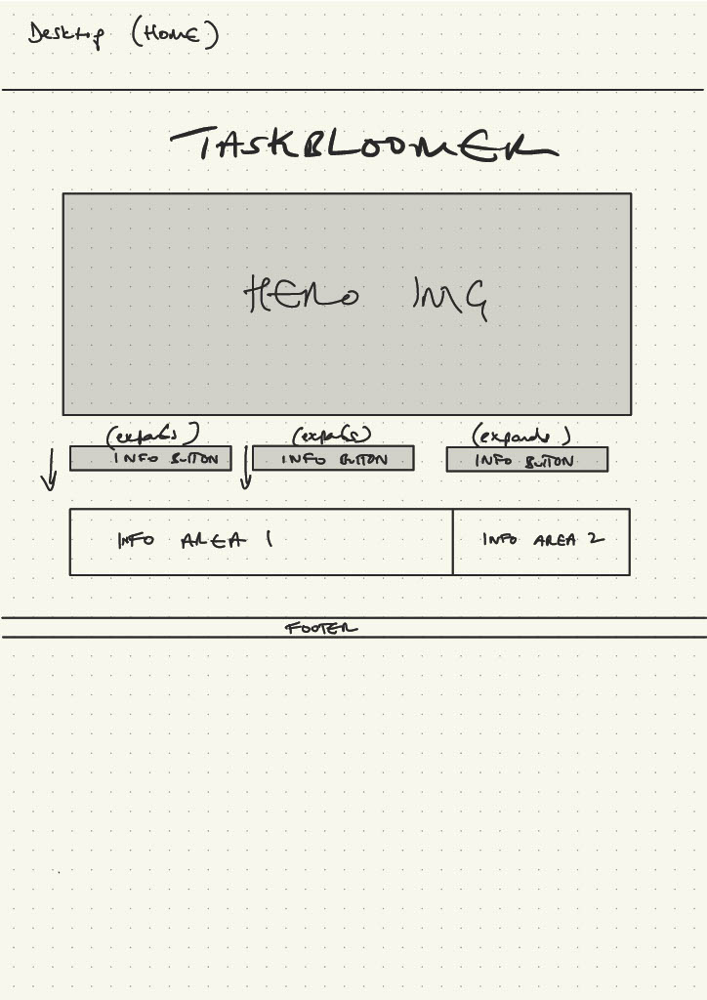
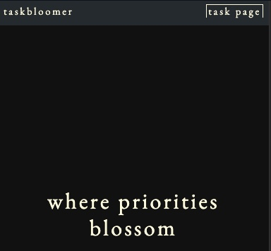
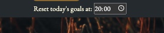
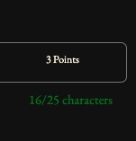
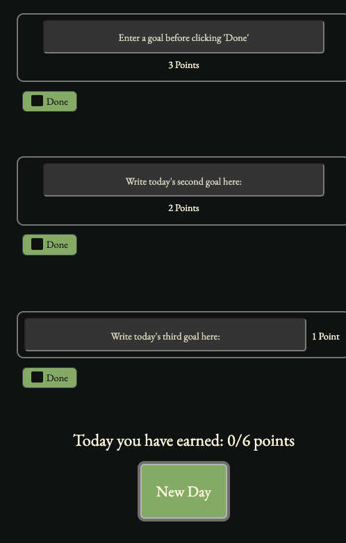

# [TASKBLOOMER](https://raymondbrien.github.io/taskbloomer)

# 🚀 TaskBloomer: Where Priorities Blossom. 🚀 

Are you drowning in a sea of tasks, struggling to stay afloat trying to decide which tasks to prioritise? Say goodbye to chaos and hello to clarity with TaskBloomer, the task management app designed reward you for making three concise to-dos which shape your day.

## 🎯 Step 1: Streamline three main goals

Create three tasks, one big, one medium, one small. Each goal must be no more than 25 characters, so aim for something concise and intentional.

Prioritize your tasks with a user-friendly interface that ensures you spend less time managing and more time accomplishing. Say goodbye to scattered to-do lists and hello to efficient, well-organized workflow in three simple steps.

## 🌟 Step 2: Rank your tasks in order of priority

Each task is ranked from biggets to smallest, represeted by the amount of points each task earns you.

Task A, your biggest task, earns you three points when you tick it off. 
Task B earns you 2 points.
Task C, 1 point.

TaskBloomer understands the toll of decision fatigue on productivity. It's interesting to notice how decision making can become easier when you have points associated with them. That's what we are exploring here. 
Guide your decision-making process effortlessly with TaskBloomer to leave you with more mental bandwidth for the tasks that truly matter.

## 🏆 Step 3: Reward yourself with each completed task

By focussing on what matters most, each time you check off a goal, your points go towards earning you an NFT. With real-time progress tracking and a gallery at the end to look through all the lovely pieces you've collected from all your hard work, you'll always be in the driver's seat, steering towards success without feeling overwhelmed.

### 🍬 Extra goodies:
1 - Track your progress with helpful stats and beautiful sets of NFTs from artists all over the world.
2 - Set the difficulty rating: choose if the amounts of points you need for each NFT are easier (less points needed per NFT), medium (a few more needed for each) or hard (for those who like a challenge).
3 - New lightmode feature for your tasks area.

✨ Simplify Your Life: Unclutter your mind and workspace for enhanced productivity.
✨ Stay Focused: Say goodbye to decision fatigue and hello to laser-sharp focus.
✨ Achieve More: Leverage your hard work by earning each time you complete a task, tracking progress to completing your gallery along the way.

🌺 TaskBloomer: Where Priorities Blossom 🌺

Dear Ambitious Achievers,

Whether you a professional seeking a better system to order their daily tasks, a freelancer juggling multiple projects feeling unrewarded by continuious to-dos, or perhaps an art enthusiast looking for their next online art collection, TaskBloomer is crafted with YOU in mind.

TaskBloomer is unique, not only because you earn points for every task you check off (which in itself is satisfying!), but your points automatically earn you assets each time you check off a task. You'll quickly find yourself noshing through those tasks for breakfast! 

The added benefit of including NFTs as part of your earning portfolio each time you hit a point threshold not only gives you the chance to look back at your NFTs and celebrate the work you have done to earn them, but also introduces you to new artists from across the globe!

https://ui.dev/amiresponsive?url=https://raymondbrien.github.io/taskbloomer

## UX

TaskBloomer's design has been inspired by productivity sites such as Notion, featuring a deluxe yet visually simple aethetic to avoid overstimulation, with the main interactive areas clear and consise.

TaskBloomer is made up intentionally of two main pages (landing page with instructions, and the main task area) to make navigation feel clean and simple to use. All bonus features such as the stats area and gallery are included with user needs in mind. 
Principally the main ideas are prioritised:
- How to play 
- Setting consise task descriptions 
- Earning NFTs 
- Checking your stats

*Your feedback is crucial, so please share your thoughts to help us refine and enhance our user-centric approach. Let's make every click count! * 🚀 

### Colour Scheme

The default color scheme is a dark theme, consisting of the follwing colors:  

- `#0e100f` used for background.
- `#fffce1` used for primary text.
- `#93B569` used for primary highlights.
- `#BDBDBD` used for secondary highlights.

If light mode is enabled on the task area by the user, the following custom variables are used: 

- `#fffce1` used for background.
- `#3D3D3D` used for primary text.
- `#93B569` used for primary highlights.
- `#2c2c2c` used for secondary highlights.

I used coolors.co to generate my colour palettes.

[coolors.co](https://coolors.co/0e100f-fffce1-93b569-bdbdbd)
[coolors.co](https://coolors.co/fffce1-3d3d3d-93b569-2c2c2c)

I also ensured that for the text and background colors for both dark and light mode were verified accessible through coolors' [coolors.co] (https://coolors.co/contrast-checker/112a46-acc8e5) color contrast checker for maximum accessibility.

### Typography

- [EB Garamond](https://fonts.google.com/specimen/EB+Garamond) was used for all text elements, chosen for its readability and established use across platforms.

- [Font Awesome](https://fontawesome.com) icons were used throughout the site, such as the icons for the hero cards on the landing page.

<!-- Add favicon source? -->

## User Stories

### New Site Users

- As a new site user, I would like to set goals, so that I can feel more in control of my to-do list for the day.
- As a new site user, I would like to reduce overwhelm, so that I can feel more productive during my day.
- As a new site user, I would like to see clean visuals, so that I don't feel overwhelmed with information.
- As a new site user, I would like to learn how to use the site, so that I can make the most of the application.
- As a new site user, I would like to track my to-dos, so that I can feel productive.

### Returning Site Users

- As a returning site user, I would like to track my progress, so that I can to remain motivated and engaged with my tasks.
- As a returning site user, I would like to make sure that if any tasks have been accidentally marked uncomplete, I can see that has happened and fix it, to make sure I earn all my points for the day.
- As a returning site user, I would like to have my tasks clear automatically, so that I can avoid unneccessary extra menial tasks.
- As a returning site user, I would like to be able to switch the colorscheme, so that I can improve the accessibility of my tasks area.

## Wireframes

### Mobile Wireframes

 Click here to see the Mobile Wireframes 

Home
  - 

Tasks Area
  - 

End Page
  - 

### Tablet Wireframes

 Click here to see the Tablet Wireframes 

Home
  - 

Tasks Area
  - 

End Page
  - 

### Desktop Wireframes

 Click here to see the Desktop Wireframes 

Home
  - 

Tasks Area
  - 

End Page
  - 

## Features

<!-- List different parts of your project.

Describe each in a sentence or so.

Explain value of each for the user:
 - who this website is for
 - what user want to achieve,
 - how your project is the best way to help them achieve these things.

For some/all of your features, you may choose to reference the specific project files that implement them.

IMPORTANT: Include a screenshot of each individual feature! -->

### Existing Features

- **Navbar**

    - The home navbar is a different color shade to the main background for improved visibility. It spans the entire width of page for a standard UI that users will likely expect. There is letter spacing styling consistent across whole navbar for improved UX. 
    The task page link includes an animation to show the user on mouse hover that the link is clickable. Task page link also has a border to immediately visually differentiate it from the app title on the left. 

- **Hero Boxes**

    - Three justified boxes in the center of the home page are used to immediately capture the user's eye and succinctly inform the user some of the main features of the app. Using consistent icons and coloring, these boxes then come with further information if the user scrolls down where each catchword is explained in mored detail about the app's features.

- **Instructions Accordion**

    - A collapsable accordion with three tabs (demarkated with both numbers and the respective amount of leaf icons colored the same as the emphasis text for continuity) on click expand on the home page to reveal step by step guidelines for how to use and make the most of the app. They first appear closed to ensure the page is not overwhelming for the user and improve page naviation. There are arrows at the right of each section to signal that they are openable to the user. 

- **Difficulty Settings**

    - An apppropriately colored set of radio buttons show the user three difficulty settings: easy, medium and hard. As is explained in the instructions, these affect the amount of points until your next NFT. Only one can be clicked at a time, and the settings have colors associated with their corresponding level type for ease of use and discoverability.

- **Light Mode**

    - Light mode toggles the task area theme between dark and light bootstrap themes with further added custom color variables added for improved visibility. This enables the user to optimise the task area of the app to suit their needs best for improved visibility.

- **Custom Reset Time**

    - The custom reset time allows the user to change the default time that their goals are automatically cleared each day, not only to give users a deadline and motivation, but also to further customise their task area workspace and avoid unneccessary menial work. This is particularly useful for returning users wanting to customise their workspace better for how they use the app.

- **Your Stats Area Toggle**

    - This area is toggled open and closed by the 'Your Stats' button near the top of the task area, to improve the UI and UX for the user by ensuring it does not take up more real estate than is needed. A returning user may find its information helpful but a first time user may find it overwhelming, hence it first loads as untoggled. 

- **Table of Stats**

    - Within the table of stats, there are three main important pieces of information, particularly useful to returning users who are familiar with how the app works. First is the 'next growth point' which demonstrates the user's next total points goal in order to earn the next NFT. Underneath this, there is a counter in brackets which shows how many points the user needs to earn before they reach that next NFT goal. Their total points is displayed below this to continue to motivate the user and inform them of their current progress.

- **Progress Bar**

    - The progress bar allows users to quickly see their progress to the next NFT in a visual way rather than a numerical way as with the table of stats. This will help motivate both new and returning users alike to continue completing their tasks on the way to earning the next NFT.

- **Goals Character Count**

    - The character counter only appears after the first time a user starts putting goals into the input areas. It reminds the user to keep their goals consise and appears green with their character count until the user comes very close to the maximum character limit of 25 characters. If the user hits 25 characters, an alert will pop up stopping the user to type further and remind them to keep their goals under 25 characters.

- **Completed Tasks**

    -Completed tasks are shown with a green border and strickthrough text for a positive UX and ease of navigation for users to identify uncompleted tasks.

- **Button Hover Styles**

    - For Stats and New Day buttons, hovers or clicks highlight functionality and clickability for user through color changes, as well as promote discoverability and accessibility for new users less familiar with the app.

- **Input Autofocus**

    - Autofocus is enabled on the first goal input on page load for new page for returning users to efficiently start adding their goals to the tasks area and direct the eye to the main area of the page. 

- **Checkbox disabled**

    - Checkboxes are disabled until goals are written in the input areas to ensure users cannot cheat.

- **Subtle Accident Warning**

    - Goal input areas are yellow if checked, then unchecked. This provides user feedback for cases of accidental checkbox toggles. 

- **New Day Button**

    - The New Day button resets each input text area's styles for users to manually click if they complete all the goals they could. The button deletes any previously written goals and reset's the day's points to zero so new goals can be written for a fresh day. The total score is still logged in the stats area. 

- **NFT Area**

    - An area with a custom border to direct attention, the largest of all the art pieces. Drag and drop functionality is enabled for users to drop their newly earned NFT into the gallery area below it.

- **Gallery Area**

    - Responsive sizing and colors for drag destination highlight for a positive UI.

- **Reset Game Button**

    - Popover with body opacity dim to highlight the popover text. After 5 seconds the user is prompted to click a button on the popover which either takes the user to the index.html page or closes the popover and remains on the unchanged game page. After 15 seconds the popover closes automatically and resets the body opacity to default for visibility if the user does not choose an option, to ensure the user is always directed back to the main game page.  

- **End Gallery**

    - Carousel for user to look through all their NFTs once they have all been collected and the end of the game has been reached at the final growth point (progress is tracked in the stats area).

- **Try-Catch Error Handling**

    - Relevant JavaScript functions have been given try-catch error handling to app maintainability and future development. Any user errors are shown if required by an alert box if absolutely necessary.

- **Links to Home Page**

    - The taskbloomer logo is always visible on the navbar which links directly back to the index.html page. 

### Future Features

- **Toggle Option for Automatic Reset**
    - To turn automatic goal self destruct on or off - this may be useful for user goals which take a few days rather than just one day.

- **Add Individual Timers for Goals with Deadlines**
    - Each goal could have its own timer with respective notifications via email if a goal is not complete 1 hour before its set deadline.

- **Add Losing Points in Hard Mode**
    - If the goal is not achieved by the end of the day when goals are reset, users will lose points.

- **Add improved CSS animations**
    - Drawing inspiration from the [Notion](https://www.notion.so/) aesthetic for design and functionality, add further animations for a positive UI without being too busy on the page.  

- **Spellcheck for Goal Inputs**
    - Implement spellcheck functionality for goal inputs to enhance user experience.

- **Style Nicer Clock Input**
    - Enhance the visual style of the clock input for a more aesthetically pleasing appearance.

- **Reminder of Task Self-Destruction**
    - Implement reminders for tasks that self-destruct to ensure users are aware of expiring tasks.

- **More NFT Collections**
    - Allow users to choose NFT collections upon signing up to the app, expanding options for personalisation.

- **Login and Password Access Anywhere**
    - Introduce a login and password system to enable access to the app from anywhere.

- **Local High Score Cache Storage**
    - Implement local high score cache storage to track and display user achievements. Show how many people are using the app and allow their achievements to be broadcast to their friends or colleagues to inspire each other.

- **End of Month Data Log Display**
    - Display an end-of-month data log showing the average time to complete each type of task.

- **Weekly Task Review**
    - Provide a feature to look back at all tasks completed at the end of each week, celebrating user successes.

- **Private Task Lock with Password**
    - Enable users to lock private/personal tasks with a password for added security and privacy.
Certainly! Here's the additional goal in the same format:

- **Add Subgoals to Complete a Main Goal**
    - Allow users to create subgoals within a main goal, providing a more granular approach to task management and accomplishment, with links and a pinboard for relevant strings of information.

## Tools & Technologies Used

- [HTML](https://en.wikipedia.org/wiki/HTML) used for the main site content.
- [CSS](https://en.wikipedia.org/wiki/CSS) used for the main site design and layout.
- [CSS :root variables](https://www.w3schools.com/css/css3_variables.asp) used for reusable styles throughout the site.
- [CSS Flexbox](https://www.w3schools.com/css/css3_flexbox.asp) used for an enhanced responsive layout.
- [CSS Grid](https://www.w3schools.com/css/css_grid.asp) used for an enhanced responsive layout for checkboxes.
- [JavaScript](https://www.javascript.com) used for user interaction on the site.
- [HTML Validator](https://validator.w3.org/) for ensuring HTML code validity.
- [CSS Validator](https://jigsaw.w3.org/css-validator/) for validating CSS code.
- [JS Validator](https://jshint.com/) for checking and validating JavaScript code.
- [Git](https://git-scm.com) used for version control. (`git add`, `git commit`, `git push`)
- [GitHub](https://github.com) used for secure online code storage.
- [GitHub Pages](https://pages.github.com) used for hosting the deployed front-end site.
- [Gitpod](https://gitpod.io) used as a cloud-based IDE for development.
- [Favicon] (https://favicon.io/favicon-converter/) used to convert my PNG hero element into the respective favicons.
- [Bootstrap](https://getbootstrap.com) used as the front-end CSS framework for modern responsiveness and pre-built components.
- [Adobe Express - Image Resize Feature](https://www.adobe.com/express/feature/image/resize)

## Testing

For all testing, please refer to the [TESTING.md](TESTING.md) file.

## Deployment

The site was deployed to GitHub Pages. The steps to deploy are as follows:

- In the [GitHub repository](https://github.com/RaymondBrien/taskbloomer), navigate to the Settings tab 
- From the source section drop-down menu, select the **Main** Branch, then click "Save".
- The page will be automatically refreshed with a detailed ribbon display to indicate the successful deployment.

The live link can be found [here](https://raymondbrien.github.io/taskbloomer)

### Local Deployment

This project can be cloned or forked in order to make a local copy on your own system.

#### Cloning

You can clone the repository by following these steps:

1. Go to the [GitHub repository](https://github.com/RaymondBrien/taskbloomer) 
2. Locate the Code button above the list of files and click it 
3. Select if you prefer to clone using HTTPS, SSH, or GitHub CLI and click the copy button to copy the URL to your clipboard
4. Open Git Bash or Terminal
5. Change the current working directory to the one where you want the cloned directory
6. In your IDE Terminal, type the following command to clone my repository:
	- `git clone https://github.com/RaymondBrien/taskbloomer.git`
7. Press Enter to create your local clone.

Alternatively, if using Gitpod, you can click below to create your own workspace using this repository.

Please note that in order to directly open the project in Gitpod, you need to have the browser extension installed.
A tutorial on how to do that can be found [here](https://www.gitpod.io/docs/configure/user-settings/browser-extension).

#### Forking

By forking the GitHub Repository, we make a copy of the original repository on our GitHub account to view and/or make changes without affecting the original owner's repository.
You can fork this repository by using the following steps:

1. Log in to GitHub and locate the [GitHub Repository](https://github.com/RaymondBrien/taskbloomer)
2. At the top of the Repository (not top of page) just above the "Settings" Button on the menu, locate the "Fork" Button.
3. Once clicked, you should now have a copy of the original repository in your own GitHub account!

### Local VS Deployment

I am aware that the local and deployment versions differ minorly in sizing. The deployed public version fills the screen more fully, though this does not negatively affect any responsivity or formatting issues to my knowledge. 

## Credits

### Content

| Source | Location | Notes |
| --- | --- | --- |
| [W3Schools](https://www.w3schools.com/howto/howto_js_topnav_responsive.asp) | entire site | responsive HTML/CSS/JS navbar |
| [W3Schools](https://www.w3schools.com/css/css3_variables.asp) | entire site | how to use CSS :root variables |
| [StackOverflow](https://stackoverflow.com/questions/54616139/how-to-animate-underline-from-left-to-right) | entire site | animations for link hover |
| [StackOverflow](https://stackoverflow.com/questions/4770025/how-to-disable-scrolling-temporarily) | game page | temporary scrolling functions |
| [MDN Web Docs - Drag Event](https://developer.mozilla.org/en-US/docs/Web/API/HTMLElement/drag_event) | game page | drag events |
| [Modern CSS](https://moderncss.dev/pure-css-custom-checkbox-style/) | game page | custom checkbox styling |

### Media

| Source                                           | Location                                       | Type   | Notes |
| ------------------------------------------------ | ---------------------------------------------- | ------ | ----- |
| [Shubham Dhage](https://unsplash.com/@theshubhamdhage) | game page | image | used as collectable 'nft' for game gallery |
| [Davi Moreira](https://unsplash.com/@me_dave)          | game page | image | used as collectable 'nft' for game gallery |
| [Chris Lee](https://unsplash.com/@chrisleeiam)         | game page | image | used as collectable 'nft' for game gallery |
| [Caleb George](https://unsplash.com/@seemoris)         | game page | image | used as collectable 'nft' for game gallery |
| [Annie Spratt](https://unsplash.com/@anniespratt)      | game page | image | used as collectable 'nft' for game gallery |
| [Marjan Blan](https://unsplash.com/@europeana)         | game page | image | used as collectable 'nft' for game gallery |
| [Europeana](https://unsplash.com/@marjan_blan)         | game page | image | used as collectable 'nft' for game gallery |
| [Czapp Botond](https://unsplash.com/@czapp_botond)     | game page | image | used as collectable 'nft' for game gallery |
| [Adobe Stock (Free)](https://stock.adobe.com/uk/images/rosemary-plant-branch-hand-draw-realistic-illustration/495247185prev_url=detailasset_id=495247185) | entire site | hero image, and favicon | originally png, changed to favicon with [Favicon] (https://favicon.io/favicon-converter/) |

### Acknowledgements

- I would like to thank my Code Institute mentor, [Rory Patrick Sheridan](https://github.com/Ri-Dearg) for their support throughout the development of this project.
- I would like to thank the [Code Institute](https://codeinstitute.net) tutor team for their assistance with troubleshooting and debugging some project issues.
- I would like to thank the [Code Institute Slack community](https://code-institute-room.slack.com) for the moral support; it kept me going during periods of self doubt and imposter syndrome.
- I would like to thank Erikas Ramanauskas [Erikas Ramanauskas](https://github.com/Erikas-Ramanauskas) for his support in my JavaScript development. 
