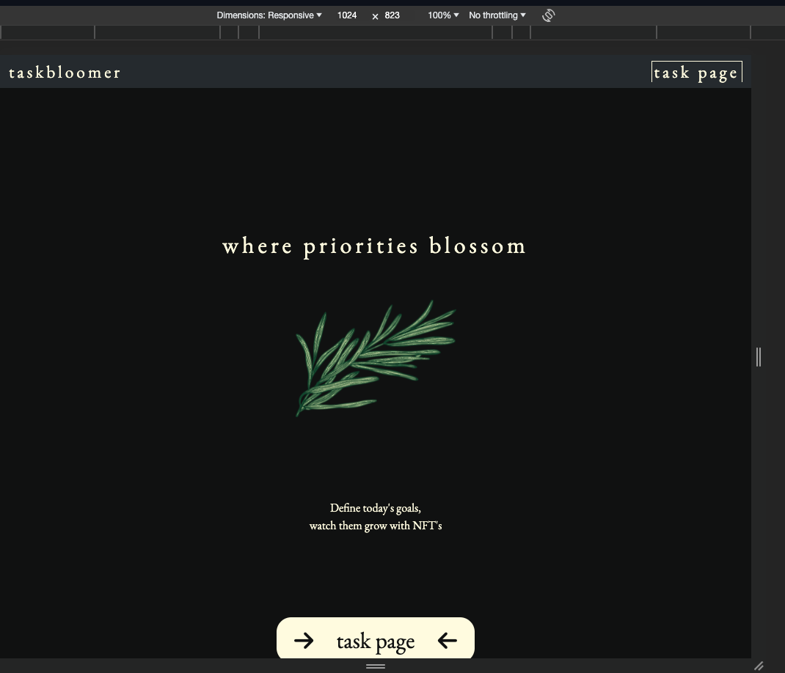
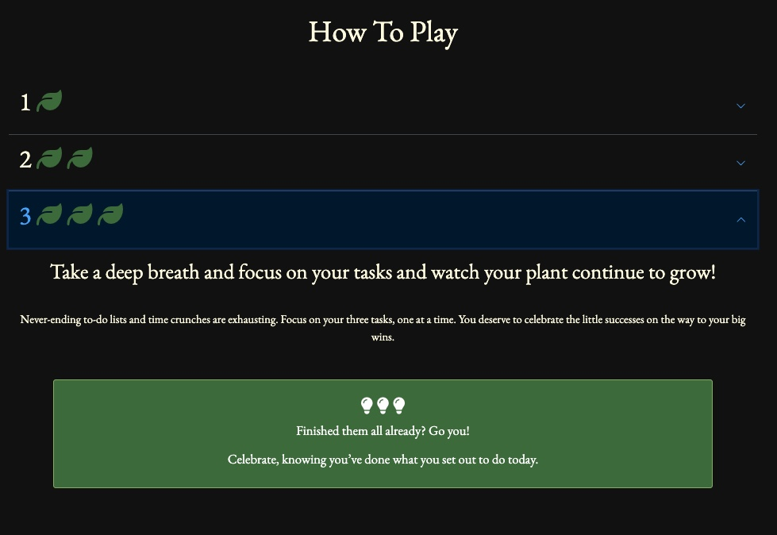
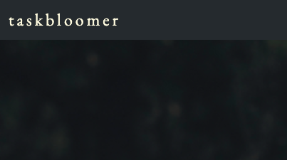
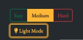
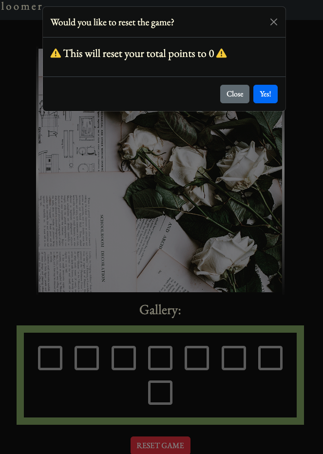
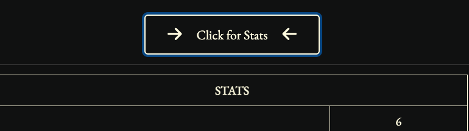

# Testing

Return back to the [README.md](README.md) file.

## Code Validation

### HTML

I have used the recommended [HTML W3C Validator](https://validator.w3.org) to validate all of my HTML files, using the live deployed site pages from GitHub Page, validating via URI.

| Page | W3C URL | Screenshot | Notes |
| --- | --- | --- | --- |
| Home | [W3C](https://validator.w3.org/nu/?doc=https%3A%2F%2Fraymondbrien.github.io%2Ftaskbloomer%2F) |  | Pass: no errors or warnings |
| Game | [W3C](https://validator.w3.org/nu/?doc=https%3A%2F%2Fraymondbrien.github.io%2Ftaskbloomer%2Fgame.html) | | Heading warning for section element. No changes required. |
| End | [W3C](https://validator.w3.org/nu/?doc=https%3A%2F%2FRaymondBrien.github.io%2Ftaskbloomer%2Fquiz.html) |  | Pass: no errors or warnings |
|

### CSS

I have used the recommended [CSS Jigsaw Validator](https://jigsaw.w3.org/css-validator) to validate all of my CSS files.

| File | Jigsaw URL | Screenshot | Notes |
| --- | --- | --- | --- |
| style.css | n/a|  | Pass: No Errors |
| end.css | n/a |  | Pass: No Errors |

### JavaScript

I have used the recommended [JShint Validator](https://jshint.com) to validate all of my JS files.

| File | Screenshot | Notes |
| --- | --- | --- |
| script.js |  | Warning about global variables |

## Browser Compatibility

The browsers I have used to test with are:
- [Chrome](https://www.google.com/chrome)
- [Firefox (Developer Edition)](https://www.mozilla.org/firefox/developer)
- [Safari](https://support.apple.com/downloads/safari)
- [Opera](https://www.opera.com/download)

I've tested my deployed project on the browsers listed to check for compatibility issues. No major issues were found.

| Browser | Home                                             | Game                                             | End                                             | Notes                  |
| ------- | ------------------------------------------------ | ------------------------------------------------- | ----------------------------------------------- | ---------------------- |
| Chrome  |  |  |  | Works as expected      |
| Firefox |  |  |  | Works as expected      |
| Safari  |  |  |  | Works as expected  |
| Opera   |  |  |  | Minor differences, but works as expected     |

## Responsiveness

I've tested my deployed project on multiple devices to check for responsiveness issues, functionality, touch/click events and formatting for different screen sizes.

| Device | Home | Game | End | Notes |
| --- | --- | --- | --- | --- |
| Mobile (DevTools) |  |  |  | Game touch-drag issues for image lead to the implementation of the 'Move Image to Gallery' button which solves this issue and actually creates an improved user experience and more satisfying UI. All other touch events work fully as expected. |
| Tablet (Real iPad 12.9" Device Used) |  |  |  | Works as expected. Touch-drag issues less prominent, if user were to drag the image into the gallery. However, as with the phone documentation, the 'Move Image to Gallery' button solves this issue and greatly improves the UI and UX for desktop and touch-enabled devices alike. All other touch events work fully as expected. |
| Desktop |  |  |  | Works as expected |
| iPhone 11 (Real Device Used) |  |  |  | Works as expected, minor image sizing issues |

## Lighthouse Audit

I've tested my deployed project using the Lighthouse Audit tool to check for any major issues.

| Page  | Mobile | Desktop | Notes                               |
| ----- | ------ | ---- | ----------------------------------- |
| Home  |  |  | Slower response time than expected due to large hero logo. Can be easily fixed for v2.0 |
| Game |  |  | Some minor warnings for mobile only |
| End   |  |  | Minor issues for response time due to large images. Can be easily fixed for v2.0. SEO score can be improved with meta descriptions being improved.|

## Defensive Programming

Defensive programming was manually tested with the below user acceptance testing:

## Home

### task page button (nav)

- **Expectation**: Link to game page with mouse hover / click animation
- **Test**: Clicked and tapped for 3 tests
- **Result**: Test concluded and passed
- **Fix**: n/a
- **Screenshot**: 

### task page button (page)

- **Expectation**: Link to game page with mouse hover / click animation
- **Test**: Clicked and tapped for 3 tests
- **Result**: Test concluded and passed
- **Fix**: n/a
- **Screenshot**: 

### accordion

- **Expectation**: accordion tabs open and close correctly
- **Test**: Open and close 3 times
- **Result**: Test concluded and passed
- **Fix**: n/a
- **Screenshot**: 

### Game

### name logo

- **Expectation**: links back to home page
- **Test**: Tried 3 times
- **Result**: Test concluded and passed
- **Fix**: n/a
- **Screenshot**: 

### navbar toggle

- **Expectation**: opens and closes with smooth animation to display settings area
- **Test**: Opens 5 times.
- **Result**: Works as expected - if viewport width is abnormally large (1573px or wider) the toggle button is shifted to right. No functionality affected
- **Fix**: n/a
- **Screenshot**: 

### Settings Easy/Medium/Hard

- **Expectation**: Changes difficulty level and displays which level has been chosen by the user. Default option shown as selected on load is medium
- **Test**: Reloaded page 3 times, each time, medium was automatically selected, logged in the consol. Everything was running as expected when trying the easy or hard modes.
- **Result**: All modes work as expected. Progress bar is dynamically changed depending on which mode is used and how much progress is currently logged
- **Fix**: n/a
- **Screenshot**: 

### Light Mode

- **Expectation**: Toggles page theme with custom css color variables. Visibility throughout the site should still be maintained for all elements including links
- **Test**: Turned off and on 3 times, checking each time for different visibility issues.
- **Result**: All elements are changed as expected, all links and colored elements remain fully visible.
- **Fix**: n/a
- **Screenshot**: 

### Reset custom time

- **Expectation**: Custom link time should toggle the newDay button automatically at the user's selected time. On first page load, this should default to 8pm; changes to this time will log how long until the function triggers in the console, based on the user's local time
- **Test**: Checked by changing the reset time to one minute later than current time. 
- **Result**: Works as expected
- **Fix**: n/a
- **Screenshot**: 

### Instructions link in settings area

- **Expectation**: Should redirect to index page 
- **Test**: Tried 4 times
- **Result**: Hover animation works and redirects to home page as expected. 
- **Fix**: n/a
- **Screenshot**: 

### task checkboxes

- **Expectation**: Checkboxes should remain diabled until goals are written in the input boxes, reset to disabled at each New Day
- **Test**: Tested on each task checkbox 3 times, two after NewDay was triggered
- **Result**: Test concluded and passed. Checkboxes are always disabled if there is no text and done is not clicked. You cannot click the 3 points checkbox more than once per day, as intended.
- **Fix**: n/a
- **Screenshot**: 

### New Day

- **Expectation**: Shows user confirmation with text appearing logging the new day, sets the day's point collection to zero without affecting the total score. Checkboxes should be disabled and the first input box should be scrolled into view after 3 seconds.
- **Test**: Tested each input box to try and cheat - before and after new day button is clicked, even with nothing written in input boxes
- **Result**: Each new day button click works as expected, clearing the form, disabling checkboxes, providing user confirmation of click and scrolling the first task box into view after 3 seconds. 
- **Fix**: n/a
- **Screenshot**: 

### Input box

- **Expectation**: Character limit shown - max limit shows text if maximum character limit of 25 characters reached. If goal is deleted, the input box is highlighted yellow and changes placeholder text, disabling checkbox until a new goal is written inside. Styles of the text should pertain only to the relevant values
- **Test**: Tried to cheat 4 times on each checkbox.
- **Result**: Works as expected
- **Fix**: n/a
- **Screenshot**: 

### Drag image functionality

- **Expectation**: Users can drag the large NFT image into the gallery, which will highlight the draggable area when near or just over it as a drop target - on drop the image will be appended as a child of the container (frame) element
- **Test**: Tried on multiple devices
- **Result**: Cannot drag image to append itself to a new frame in the gallery once it has been assigned its frame in the gallery but I consider this to be a good solution to what would otherwise be a chaotic solution of assigning each image only to a specific box which would need a large amount of user guidance text for which there is no real estate available within that section without overcrowding the page
- **Fix**: n/a
- **Screenshot**: 

### Game reset button

- **Expectation**: Should open a modal that you cannot click off but clicking outside the modal box - only the close button will close the modal
- **Test**: Tried three times during game and two on new page loads
- **Result**: works as expected
- **Fix**: n/a
- **Screenshot**: 

### Game reset popover YES

- **Expectation**: Redirect user back to index.html page and reset entire game. It was preferred to take users back to home page to always allow the users to check the instructions again before using - this was found to be useful in early development for new users to remind them how the game works
- **Test**: Tried three times during game and two on new page loads
- **Result**: works as expected
- **Fix**: n/a
- **Screenshot**: 

### Game reset popover NO

- **Expectation**: Closes popover with no affect to the game, reestablishes opacity of body for page visibility to continue use as expected
- **Test**: Opened and closed whilst also trying to overload the page with the settings and stats tabs open.
- **Result**: Works as expected, always loads the modal above all other elements and is not dismissable unless the close button is clicked. If user clicks outside the modal body, an animation directing focus to the modal box plays as expected, via bootstrap js.
- **Fix**: n/a
- **Screenshot**: 

### Stats toggle

- **Expectation**: Should open and close with relevant information displayed and updated dynamically via script.js for progress bar, and stats table. Links to
- **Test**: Open and close at 3 different times during using the app after 1, 2 and 3 new days were logged via clicking the new day button
- **Result**: Works as expected
- **Fix**: n/a
- **Screenshot**: 

### Stats toggle links

- **Expectation**: Links in the links section at the bottom of the stats section and as hyperlinks in text area within developer description. Links are to github repo and developer github profile and developer linkedIn.
- **Test**: Clicked on links 3 times each
- **Result**: Link always opens in new tab and lands on each page as expected without affecting the game page. Each has the hover animation for text links as expected for UI.
- **Fix**: n/a
- **Screenshot**: 

### Instructions link in footer

- **Expectation**: Href back to index.html; should scroll instructions accordion immediately into view. Github link should send user to github repo for the project
- **Test**: Clicked 3 times
- **Result**: Works as expected 
- **Fix**: n/a
- **Screenshot**: 

## End

### Back to Start Page button

- **Expectation**: Returns the user back to the home page where the game can be started again. Progress should not remain within the game cache.
- **Test**: Tested 3 times
- **Result**: Works as expected. Button could be more visible due to padding issue.
- **Fix**: Reduce padding top for body element on end.html to make the home button more discoverable.
- **Screenshot**: 

## User Story Testing

<!-- Most of your project's **features** should already align with the **user stories**,
so this should as simple as creating a table with the user story, matching with the re-used screenshot
from the respective feature. -->

| User Story | Screenshot |
| --- | --- |
| As a new site user, I would like to ____________, so that I can ____________. |  |
| As a new site user, I would like to ____________, so that I can ____________. |  |
| As a new site user, I would like to ____________, so that I can ____________. |  |
| As a returning site user, I would like to ____________, so that I can ____________. |  |
| As a returning site user, I would like to ____________, so that I can ____________. |  |
| As a returning site user, I would like to ____________, so that I can ____________. |  |
| As a site administrator, I should be able to ____________, so that I can ____________. |  |
| As a site administrator, I should be able to ____________, so that I can ____________. |  |
| As a site administrator, I should be able to ____________, so that I can ____________. |  |
| repeat for all remaining user stories | x |

## Bugs

<!-- This section is primarily used for JavaScript and Python applications,
but feel free to use this section to document any HTML/CSS bugs you might run into.

It's very important to document any bugs you've discovered while developing the project.
Make sure to include any necessary steps you've implemented to fix the bug(s) as well.

**PRO TIP**: screenshots of bugs are extremely helpful, and go a long way! -->

- JS Uncaught ReferenceError: `foobar` is undefined/not defined

    

    - To fix this, I _____________________.

- JS `'let'` or `'const'` or `'template literal syntax'` or `'arrow function syntax (=>)'` is available in ES6 (use `'esversion: 11'`) or Mozilla JS extensions (use moz).

    

    - To fix this, I _____________________.

### Move image to gallery button

- **Expectation**: Should move any image that is currently in the NFT area into the gallery and resize the image appropriately. If there is no image, nothing occurs
- **Test**: Tried on multiple devices
- **Result**: If first frame is not filled, it is possible to click new day without adding the first image, and skipping the first frame
- **Fix**: FIX
- **Screenshot**:

## Unfixed Bugs

<!-- You will need to mention unfixed bugs and why they were not fixed.
This section should include shortcomings of the frameworks or technologies used.
Although time can be a big variable to consider, paucity of time and difficulty understanding
implementation is not a valid reason to leave bugs unfixed.

If you've identified any unfixed bugs, no matter how small, be sure to list them here.
It's better to be honest and list them, because if it's not documented and an assessor finds the issue,
they need to know whether or not you're aware of them as well, and why you've not corrected/fixed them. -->

Some examples:

- On devices smaller than 375px, the page starts to have `overflow-x` scrolling.

    

    - Attempted fix: I tried to add additional media queries to handle this, but things started becoming too small to read.

- When validating HTML with a semantic `section` element, the validator warns about lacking a header `h2-h6`. This is acceptable.

    

    - Attempted fix: this is a known warning and acceptable, and my section doesn't require a header since it's dynamically added via JS.

### Carousel

- **Expectation**: Autoplays through the images within the carousel container; users can click on a particular point within the carousel progress bar to show a particular image
- **Test**: tested with mouse clicks for all image slide points
- **Result**: image resizes larger when animating to the next slide, very briefly covering the clickable carousel elements and the home button underneath
- **Fix**: This appears to be a bootstrap issue - I have tried to fix the issue by reducing image size though this does not solve the issue.
- **Screenshot**:

<!-- 
If you legitimately cannot find any unfixed bugs or warnings, then use the following sentence:

There are no remaining bugs that I am aware of. -->
