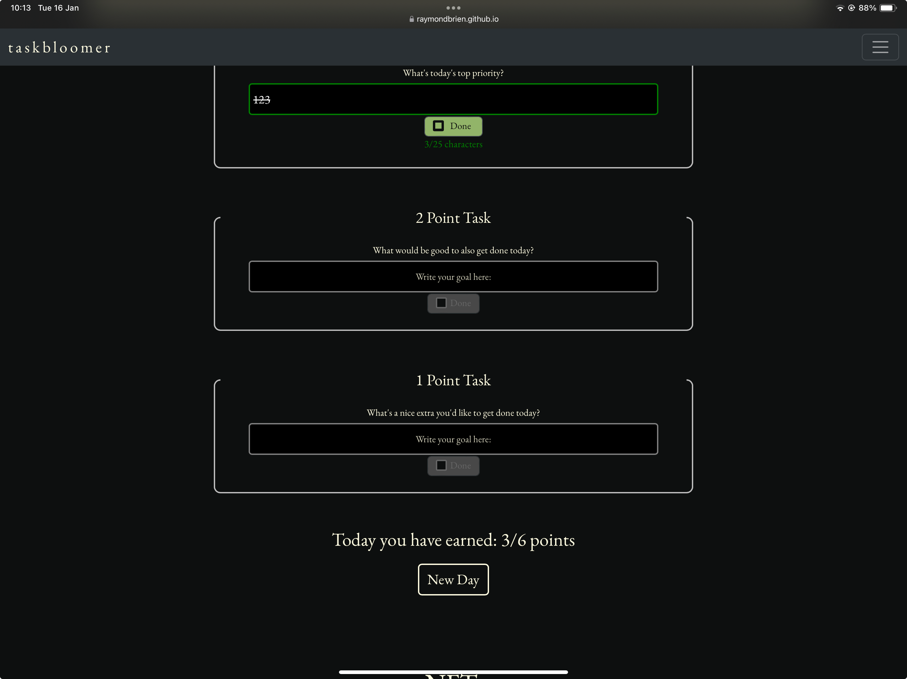

# Testing

Return back to the [README.md](README.md) file.

## Code Validation

### HTML

I have used the recommended [HTML W3C Validator](https://validator.w3.org) to validate all of my HTML files, using the live deployed site pages from GitHub Page, validating via URI.

| Page | W3C URL | Screenshot | Notes |
| --- | --- | --- | --- |
| Home | [W3C](https://validator.w3.org/nu/?doc=https%3A%2F%2Fraymondbrien.github.io%2Ftaskbloomer%2F) |  | Pass: no errors or warnings |
| Game | [W3C](https://validator.w3.org/nu/?doc=https%3A%2F%2Fraymondbrien.github.io%2Ftaskbloomer%2Fgame.html) | | Heading warning for section element. No changes required. |
| End | [W3C](https://validator.w3.org/nu/?doc=https%3A%2F%2FRaymondBrien.github.io%2Ftaskbloomer%2Fquiz.html) |  | Pass: no errors or warnings |
|

### CSS

I have used the recommended [CSS Jigsaw Validator](https://jigsaw.w3.org/css-validator) to validate all of my CSS files.

| File | Jigsaw URL | Screenshot | Notes |
| --- | --- | --- | --- |
| style.css | n/a|  | Pass: No Errors |
| end.css | n/a |  | Pass: No Errors |

### JavaScript

I have used the recommended [JShint Validator](https://jshint.com) to validate all of my JS files.

| File | Screenshot | Notes |
| --- | --- | --- |
| script.js |  | Warning about global variables |

## Browser Compatibility

The browsers I have used to test with are:
- [Chrome](https://www.google.com/chrome)
- [Firefox (Developer Edition)](https://www.mozilla.org/firefox/developer)
- [Safari](https://support.apple.com/downloads/safari)
- [Opera](https://www.opera.com/download)

I've tested my deployed project on the browsers listed to check for compatibility issues. No major issues were found.

| Browser | Home                                             | Game                                             | End                                             | Notes                  |
| ------- | ------------------------------------------------ | ------------------------------------------------- | ----------------------------------------------- | ---------------------- |
| Chrome  |  |  |  | Works as expected      |
| Firefox |  |  |  | Works as expected      |
| Safari  |  |  |  | Works as expected  |
| Opera   |  |  |  | Minor differences, but works as expected     |

## Responsiveness

I've tested my deployed project on multiple devices to check for responsiveness issues, functionality, touch/click events and formatting for different screen sizes.

| Device | Home | Game | End | Notes |
| --- | --- | --- | --- | --- |
| Mobile (DevTools) |  |  |  | Game touch-drag issues for image lead to the implementation of the 'Move Image to Gallery' button which solves this issue and actually creates an improved user experience and more satisfying UI. All other touch events work fully as expected. |
| Tablet (Real iPad 12.9" Device Used) |  |  |  | Works as expected. Touch-drag issues less prominent, if user were to drag the image into the gallery. However, as with the phone documentation, the 'Move Image to Gallery' button solves this issue and greatly improves the UI and UX for desktop and touch-enabled devices alike. All other touch events work fully as expected. |
| Desktop |  |  |  | Works as expected |
| iPhone 11 (Real Device Used) |  |  |  | Works as expected, minor image sizing issues |

## Lighthouse Audit

I've tested my deployed project using the Lighthouse Audit tool to check for any major issues.

| Page  | Mobile | Desktop | Notes                               |
| ----- | ------ | ---- | ----------------------------------- |
| Home  |  |  | Slower response time than expected due to large hero logo |
| Game |  |  | Some minor warnings for mobile only |
| End   |  |  | Minor issues for response time due to large images |

## Defensive Programming

<!-- Defensive programming (defensive design) is extremely important!

When building projects that accept user inputs or forms, you should always test the level of security for each.
Examples of this could include (not limited to):

Forms:
- Users cannot submit an empty form
- Users must enter valid email addresses

You should include any manual tests performed, and the expected results/outcome.

Testing should be replicable.
Ideally, tests cases should focus on each individual section of every page on the website.
Each test case should be specific, objective, and step-wise replicable.

Instead of adding a general overview saying that everything works fine,
consider documenting tests on each element of the page
(ie. button clicks, input box validation, navigation links, etc.) by testing them in their happy flow,
and also the bad/exception flow, mentioning the expected and observed results,
and drawing a parallel between them where applicable.

Consider using the following format for manual test cases:

Expected Outcome / Test Performed / Result Received / Fixes Implemented

- **Expected**: "Feature is expected to do X when the user does Y."
- **Testing**: "Tested the feature by doing Y."
- (either) **Result**: "The feature behaved as expected, and it did Y."
- (or) **Result**: "The feature did not respond to A, B, or C."
- **Fix**: "I did Z to the code because something was missing."

Use the table below as a basic start, and expand on it using the logic above. -->

Defensive programming was manually tested with the below user acceptance testing:

| Page | Expectation | Test | Result | Fix | Screenshot |
| --- | --- | --- | --- | --- | --- |
| Home | | | | | |
| | Feature is expected to do X when the user does Y | Tested the feature by doing Y | The feature behaved as expected, and it did Y | Test concluded and passed |  |
| | Feature is expected to do X when the user does Y | Tested the feature by doing Y | The feature did not respond to A, B, or C. | I did Z to the code because something was missing |  |
| About | | | | | |
| | Feature is expected to do X when the user does Y | Tested the feature by doing Y | The feature behaved as expected, and it did Y | Test concluded and passed |  |
| | Feature is expected to do X when the user does Y | Tested the feature by doing Y | The feature did not respond to A, B, or C. | I did Z to the code because something was missing |  |
| Gallery | | | | | |
| | Feature is expected to do X when the user does Y | Tested the feature by doing Y | The feature behaved as expected, and it did Y | Test concluded and passed |  |
| | Feature is expected to do X when the user does Y | Tested the feature by doing Y | The feature did not respond to A, B, or C. | I did Z to the code because something was missing |  |
| Contact | | | | | |
| | Feature is expected to do X when the user does Y | Tested the feature by doing Y | The feature behaved as expected, and it did Y | Test concluded and passed |  |
| | Feature is expected to do X when the user does Y | Tested the feature by doing Y | The feature did not respond to A, B, or C. | I did Z to the code because something was missing |  |
| repeat for all remaining pages | x | x | x | x | x |

<!-- Another way of performing defensive testing is a simple Pass/Fail for each test.
The assessors prefer the above method, with the full test explained, but this is also acceptable in most cases. -->

<!-- When in doubt, use the above method instead, and delete the table below. -->

<!-- 
| Page | User Action | Expected Result | Pass/Fail | Comments |
| --- | --- | --- | --- | --- |
| Home | | | | |
| | Click on Logo | Redirection to Home page | Pass | |
| | Click on Home link in navbar | Redirection to Home page | Pass | |
| Gallery | | | | |
| | Click on Gallery link in navbar | Redirection to Gallery page | Pass | |
| | Load gallery images | All images load as expected | Pass | |
| Contact | | | | |
| | Click on Contact link in navbar | Redirection to Contact page | Pass | |
| | Enter first/last name | Field will accept freeform text | Pass | |
| | Enter valid email address | Field will only accept email address format | Pass | |
| | Enter message in textarea | Field will accept freeform text | Pass | |
| | Click the Submit button | Redirects user to form-dump | Pass | User must click 'Back' button to return |
| Sign Up | | | | |
| | Click on Sign Up button | Redirection to Sign Up page | Pass | |
| | Enter valid email address | Field will only accept email address format | Pass | |
| | Enter valid password (twice) | Field will only accept password format | Pass | |
| | Click on Sign Up button | Asks user to confirm email page | Pass | Email sent to user |
| | Confirm email | Redirects user to blank Sign In page | Pass | |
| Log In | | | | |
| | Click on the Login link | Redirection to Login page | Pass | |
| | Enter valid email address | Field will only accept email address format | Pass | |
| | Enter valid password | Field will only accept password format | Pass | |
| | Click Login button | Redirects user to home page | Pass | |
| Log Out | | | | |
| | Click Logout button | Redirects user to logout page | Pass | Confirms logout first |
| | Click Confirm Logout button | Redirects user to home page | Pass | |
| Profile | | | | |
| | Click on Profile button | User will be redirected to the Profile page | Pass | |
| | Click on the Edit button | User will be redirected to the edit profile page | Pass | |
| | Click on the My Orders link | User will be redirected to the My Orders page | Pass | |
| | Brute forcing the URL to get to another user's profile | User should be given an error | Pass | Redirects user back to own profile |
| repeat for all remaining pages | x | x | x | x | -->

## User Story Testing

<!-- Most of your project's **features** should already align with the **user stories**,
so this should as simple as creating a table with the user story, matching with the re-used screenshot
from the respective feature. -->

| User Story | Screenshot |
| --- | --- |
| As a new site user, I would like to ____________, so that I can ____________. |  |
| As a new site user, I would like to ____________, so that I can ____________. |  |
| As a new site user, I would like to ____________, so that I can ____________. |  |
| As a returning site user, I would like to ____________, so that I can ____________. |  |
| As a returning site user, I would like to ____________, so that I can ____________. |  |
| As a returning site user, I would like to ____________, so that I can ____________. |  |
| As a site administrator, I should be able to ____________, so that I can ____________. |  |
| As a site administrator, I should be able to ____________, so that I can ____________. |  |
| As a site administrator, I should be able to ____________, so that I can ____________. |  |
| repeat for all remaining user stories | x |

## Bugs

<!-- This section is primarily used for JavaScript and Python applications,
but feel free to use this section to document any HTML/CSS bugs you might run into.

It's very important to document any bugs you've discovered while developing the project.
Make sure to include any necessary steps you've implemented to fix the bug(s) as well.

**PRO TIP**: screenshots of bugs are extremely helpful, and go a long way! -->

- JS Uncaught ReferenceError: `foobar` is undefined/not defined

    

    - To fix this, I _____________________.

- JS `'let'` or `'const'` or `'template literal syntax'` or `'arrow function syntax (=>)'` is available in ES6 (use `'esversion: 11'`) or Mozilla JS extensions (use moz).

    

    - To fix this, I _____________________.

## Unfixed Bugs

<!-- You will need to mention unfixed bugs and why they were not fixed.
This section should include shortcomings of the frameworks or technologies used.
Although time can be a big variable to consider, paucity of time and difficulty understanding
implementation is not a valid reason to leave bugs unfixed.

If you've identified any unfixed bugs, no matter how small, be sure to list them here.
It's better to be honest and list them, because if it's not documented and an assessor finds the issue,
they need to know whether or not you're aware of them as well, and why you've not corrected/fixed them. -->

Some examples:

- On devices smaller than 375px, the page starts to have `overflow-x` scrolling.

    

    - Attempted fix: I tried to add additional media queries to handle this, but things started becoming too small to read.

- For PP3, when using a helper `clear()` function, any text above the height of the terminal does not clear, and remains when you scroll up.

    

    - Attempted fix: I tried to adjust the terminal size, but it only resizes the actual terminal, not the allowable area for text.

- When validating HTML with a semantic `section` element, the validator warns about lacking a header `h2-h6`. This is acceptable.

    

    - Attempted fix: this is a known warning and acceptable, and my section doesn't require a header since it's dynamically added via JS.

<!-- 
If you legitimately cannot find any unfixed bugs or warnings, then use the following sentence:

There are no remaining bugs that I am aware of. -->
